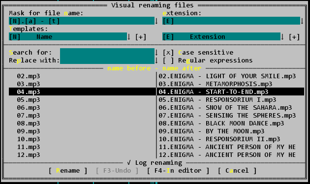

# VisRen
Plugin for visual rename files in Far Manager 3.



## How to build from source
To build plugin from source, you will need:

* Visual Studio 2019
* cmake 3.15 (included in Visual Studio 2019)

#### Release
From root of source call `vc.build.release.cmd`. The build result will be in ./bin folder.

#### Debug or develop
For example: 
```
call "C:\Program Files (x86)\Microsoft Visual Studio\2019\Community\VC\Auxiliary\Build\vcvarsall.bat" x64
mkdir cmake-build-debug
cd cmake-build-debug
cmake .. -DCMAKE_BUILD_TYPE=Debug -G "Visual Studio 16 2019"
VisRen.sln
```

# Common info
* Extracted from: https://github.com/FarPlugins/farplug-alvls 
* PlugRing page: https://plugring.farmanager.com/plugin.php?pid=801
* Discuss: https://forum.farmanager.com/viewtopic.php?f=11&t=2810
